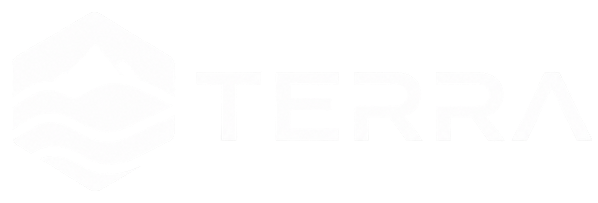
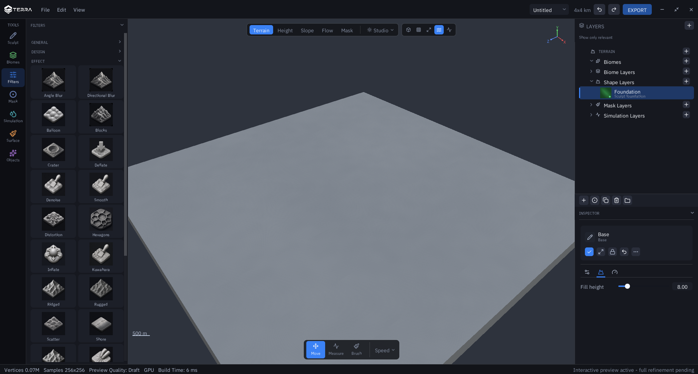

<p align="center">
  
</p>

<p align="center">
  
</p>

# Terra

> [!CAUTION]
> ## Not ready for production
>
> **Terra is an early, unfinished work-in-progress.** Do not use it for shipping games, film pipelines, or any production workflow. Builds may crash, corrupt projects, or change behavior without warning. APIs, file formats, and UI are unstable.
>
> Large parts of the editor are incomplete or only sketched in:
>
> - **Real-time terrain visualization** — progressive Draft→Full preview with a hybrid GPU+CPU path exists, but live feedback still needs major refinement; expect laggy, approximate, or stale results
> - **Export pipeline** — the Export button re-evaluates at export resolution on a background worker and writes a package (16-bit PNG + 32-bit float TIFF heights, selectable 16-bit aux maps, `manifest.json` with de-normalization metadata); formats are still unstable
> - **Objects** — vegetation scatter and a multi-class Scatter Objects layer exist; there is still no per-instance authoring (placing / moving a single prop by hand)
> - **Materials** — material IDs / strata / hardness and viewport tinting exist; this is not a full shading or surface-authoring pipeline
>
> Treat everything you see as experimental scaffolding. Star the repo, experiment locally, and contribute if you like — but do not depend on Terra for real work yet.

**Terra** aims to be a **free and open-source**, layer-based terrain and landscape creator — heavily inspired by [World Creator](https://www.world-creator.com/), with a familiar stack of layers, masks, and tools rather than a node-graph UI.

The goal is a real-time authoring environment where artists compose landforms, biomes, masks, and simulations on a progressive heightfield, then export results for games, film, and other pipelines.

## Vision

- **Layer-and-mask workflow** — paint, stack, and blend terrain like a digital landscape canvas
- **Free & open source** — MIT; anyone can use, study, and contribute
- **Artist-first** — shape tools, biomes, masks, and world rules without wiring a graph
- **Real-time preview** — progressive / multi-resolution evaluation with optional GPU compute

## Current status

Early development, but past empty scaffolding. A usable **layer-stack editor** is in place: heightfields, masks/distributions, biomes, shape tools, CPU evaluation, progressive Draft→Medium→Full preview, and a wgpu viewport with a hybrid GPU path for many generators and filters.

Still incomplete or experimental: export readiness/UX, materials shading, object/prop scattering beyond basic vegetation, volumetric overhangs/caves, and several simulations that are CPU-heavy or only partially on GPU. Product “Regions” were removed in favor of a single World Creator–style stack (biomes, masks, and world rules own placement).

See the disclaimer above before relying on any of this.

## Features (in progress)

- Layer stack with blend modes, groups, biome containers, masks, and distribution / placement rules
- Shape layers and brushes (procedural landforms, stamps, paths, polygons, sculpt base/strokes, heightmap import) plus shape objects
- Biome paint & placement, Apply Where, and world rules
- Progressive Draft→Full evaluation with hybrid GPU+CPU preview (`terra-gpu` / `terra-render`)
- Geomorph, erosion, hydrology, and landscape-evolution operators (CPU foundations; GPU subset for common generators/filters and thermal/hydraulic)
- New World templates (`WorldTemplate`: Blank, Tropical Island, Alpine Range, Desert Mesa, River Valley, Badlands, Young/Old Mountains, Dune Field, Coastal)
- Project JSON save/load; heightmap-oriented export package via `terra-io` (not production-ready)
- Undo/redo for stack edits, paint strokes, world rules, and simulation scenarios
- Editor workspaces: Sculpt, Biomes, Filters, Mask, Simulation, Surface, Objects

## Stack

| Crate | Role |
|-------|------|
| `terra-core` | Heightfields, layers, masks, biomes, CPU evaluation, commands |
| `terra-gpu` | WGSL compute for supported generators, filters, and erosion |
| `terra-render` | wgpu 3D viewport / clipmaps / progressive presentation |
| `terra-gui` | Custom immediate-mode wgpu UI toolkit (not egui) |
| `terra-app` | Editor chrome, panels, tools; application binary (winit event loop + wiring) |
| `terra-io` | Project JSON, export package, limited grayscale GeoTIFF import |

`terra-core` must stay free of `wgpu` and UI crates. `terra-gui` must stay free of domain types.

## Build & run

Requires a recent Rust toolchain (edition 2021) and a working wgpu/GPU driver.

```bash
cargo run -p terra-app
cargo test --workspace
```

Real-time viewport path: GPU height/normal textures + static grid displacement (no mesh rebuild). Enable **View → Profiler** for per-frame timings.

## Documentation

User-facing guides for authoring terrain. Treat these as orientation — the product is early and unfinished.

Terra uses a **layer stack** (World Creator–style), not a node graph. Workspaces change which tools are emphasized; they do not lock you into a fixed pipeline.

| Guide | What it covers |
|-------|----------------|
| [Workflow structure](docs/workflow.md) | Layer stack, biomes, masks, workspaces, and how pieces fit together |
| [Creating terrain](docs/creating-terrain.md) | New project → sculpt → biomes → filters → save |
| [Editor overview](docs/editor.md) | Shell layout, panels, and common actions |

## Contributing

Contributions are welcome as the project takes shape. See [CONTRIBUTING.md](CONTRIBUTING.md).

## License

Licensed under the [MIT License](LICENSE).
