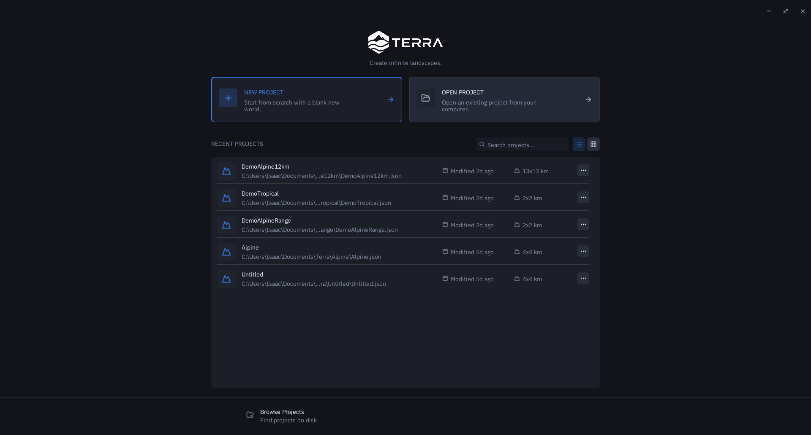
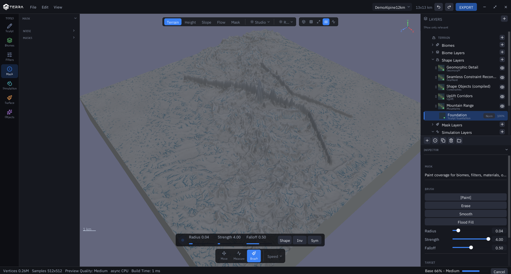
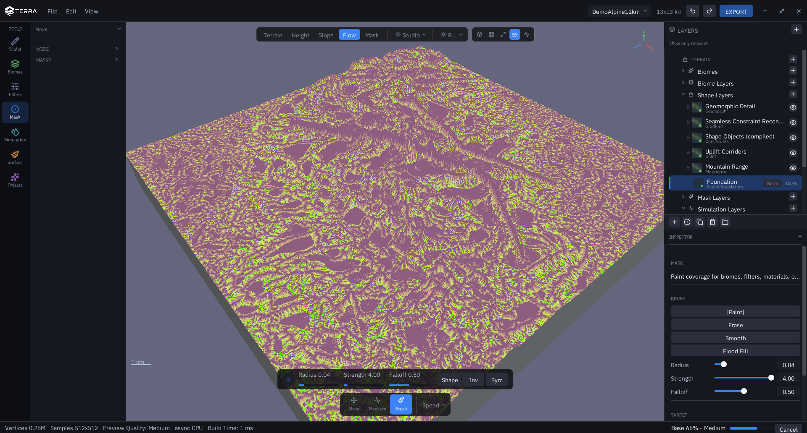
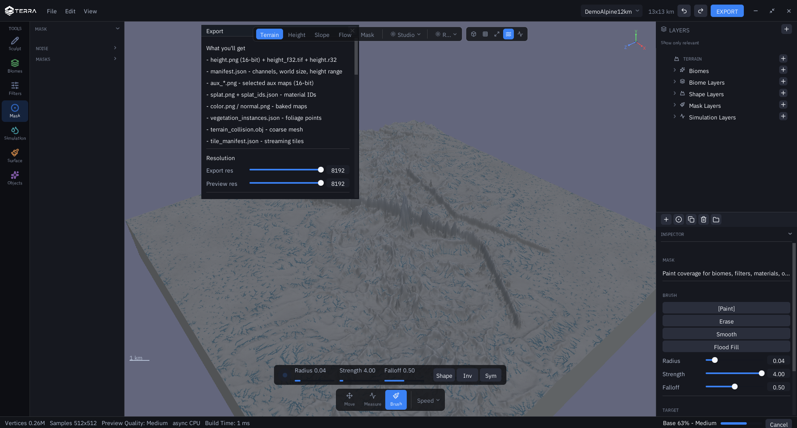

# Screenshots

Captured from a local debug build of this fork at commit `77a752b`, on Windows
with the DX12 backend. World is a 13x13 km "Alpine Range" archetype at 1024.

## Project browser

Launcher with recent projects, world size per entry, and a search box.

## Editor and layer stack

The 3D viewport with the Shape Layers group expanded: Foundation, Mountain
Range, Uplift Corridors, Shape Objects (compiled), Seamless Constraint
Reconstruction and Geomorphic Detail. Each row carries its own visibility
toggle, and the selected row shows blend mode and opacity inline. Drainage
networks are visible across the range.

## Aux channel views

The viewport switched to the Flow channel. The engine publishes around 40 named
aux channels (slope, wetness, sediment thickness, flow accumulation, scatter
density, hardness and others); the toolbar exposes Terrain, Height, Slope, Flow
and Mask. A panel for browsing the rest of them is the next thing on the list.

## Export package

The export panel listing what a package contains: 16-bit `height.png`, 32-bit
float `height_f32.tif` and `height.r32`, `manifest.json` with channels, world
size and height range, selected 16-bit aux maps, splat maps with material IDs,
baked color and normal maps, vegetation instances, a coarse collision mesh and
a streaming tile manifest.

## Not shown here, and why

- **Scatter Objects** renders instanced boxes rather than real meshes. Placement,
  classes, determinism, export and viewport are done; real prop meshes need an
  asset pipeline. There is also no per-instance authoring yet.
- **Export formats are still unstable** and the package is not production ready.
- Two issues reproduce on this fork and on its upstream merge base, so they are
  not introduced by the work here:
  - Archetype relief does not scale with world size. Relief is roughly constant
    in absolute metres, so a 1-2 km world gets a mountain taller than the world
    is wide. The archetypes are authored for roughly 10 km worlds, which is why
    the world above is 13 km.
  - Progressive refinement does not converge. It sits in the 60-70% range and
    the evaluation appears to restart rather than finish.
